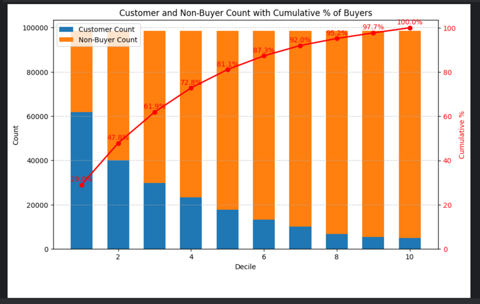

## Overview

I'm exploring increasing levels of sophistication for a propensity to buy model and measuring the results.

The data is sourced from Kaggle: https://www.kaggle.com/competitions/h-and-m-personalized-fashion-recommendations/

## Business Problem

When using a high cost marketing channel it is far more profitable to target customers (or prospects) with a high likelihood of conversion.

Think of all the junk mail you immediately throw away or the remarketing you ignore.  Or on the flip side, the catalog you dog ear and then plan a shopping trip with a friend.

A propensity model would be one of many steps to implement a successful marketing campaign, including:
* Identity resolution (aka deduplication, user graph)
* Address validation
* Assure a match-back strategy for in-store purchases
* A/B/Holdout testing

This repository solely focuses on the propensity model.

Here are the results of a backtest of a simple model.  I consider this my **_baseline_**.
* Recency, Frequency, Monetary features for the entire prior year
* Random Forest with default parameters
* Label 60-30 days ago
* Backtest prior 30 days 

Result: 60k buyers in top 100k ranked customers or in relative terms, 29% of buyers in top 10% of scored customers.

I think these results will be challenging to improve upon.  I will see.  

I probably should have artificially hobbled the baseline for a wow factor!

(University of Illinois colors)

## Notebooks

In each notebook I intend to limit the scope of exploration to 1-2 topics or ideas.

Outline:
* 00 - Rules based - _not started_
* 01 - Using simple features with logistic regression & random forest
* 02 - Handling of outliers & standardizing features
* 03 - Introduce additional features - AOV, time based features, customer categorical attributes
* 04 - Tidy up some repeatable pieces (pre processing pipeline, features, backtest)
* 05 - TBD
* 06 - Hyperparameter search
* 07 - Gradient boost
* 08 - More features (seasonality + temporal shifting, price sensitivity, product categories)
* 09 - PCA - this might move before Gradient Boost depending on results
* 10 - Feed forward neural network (using partially connected layers for different feature groupings)

Other ideas:
* 11 - Feature Cross + Dimensional Reduction
* 12 - Autoencoder as alternative to PCA

## My Motivation

I've implemented and deployed many flavors of propensity models for dozens of retail companies.  I wanted to further explore some of my more esoteric (or maybe questionable) ideas.  

Additionally I needed a way to demonstrate my prior work, to prospective employers, for more technically focused roles.  As I do not have access to my prior work, I'm in part re-creating a small portion, without aid of an existing framework, so I'm evolving that as well.

Besides propensity to buy, I plan a similar series for:
* Customer segmentation via unsupervised learning
* Personal product recommendations

Feature engineering:
* Personal seasonality - that is, some buyers will routinely purchase the same time each year ... events, season, birthdays, holidays
* Price sensitivity - an individuals price sensitivity relative to the current discounts offered
* (Very detailed) temporal aggregation (aka time based-feature engineering) - here increasing the number of features and using short time slices to see when model improvements taper off
* Training record "augmentation" (or temporal shifting, lagged feature stacking, diagonal slices) ... build upon what I've done in the past
* Regression vs. Classification - allowing for more nuance such as time decayed sum of future transactions
* Feature crossing + automated feature selection

Data preparation/pre-processing:
* Explore the impact of not balancing, under sampling, oversampling
* Explore the impact of aggressive Winsorization, moderate Winsorization, and no Winsorization (but just row wise outlier treatment)

Tools:
* (At work) I use Spark (so Spark dataframes, MLlib), I wanted to try out Polars & DuckDB
* PyTorch for feed forward neural network
* Different dimensional reduction technics

